<div align="center">

<picture>
  <source media="(prefers-color-scheme: dark)" srcset="Documentation/Brand/veyra-logo-dark.png">
  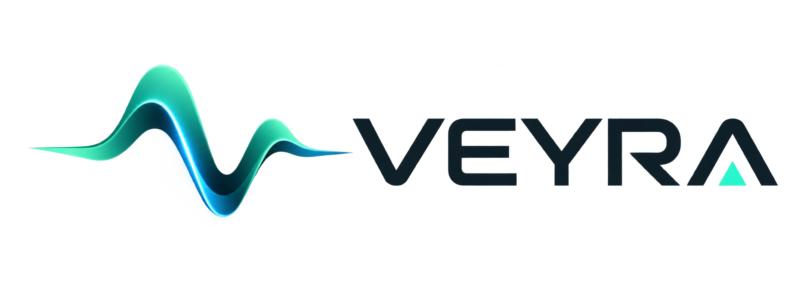
</picture>

**Personal health dashboard for iPhone and Apple Watch.**
Sleep, recovery, strain, stress and energy reserves — computed entirely on device, with the confidence in plain sight.

<br>


</div>

---

## What it is

Veyra reads what your Apple Watch already writes to Apple Health and turns it
into five daily metrics, their trends, and a biological-age estimate.
**Everything is computed on device**: no account, no server, no telemetry.

One principle governs the whole project: **missing data is shown as missing,
never as zero**, and every score carries the confidence it deserves along with
the specific reasons it is not higher.

<div align="center">

| Home | Body battery | Sleep |
|:---:|:---:|:---:|
| 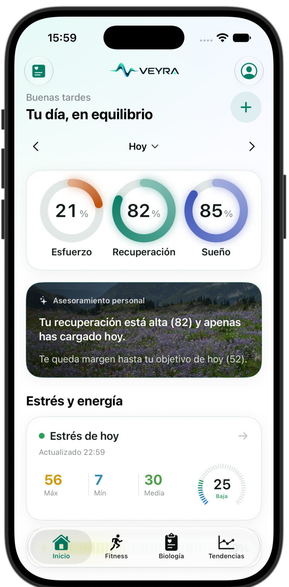 | 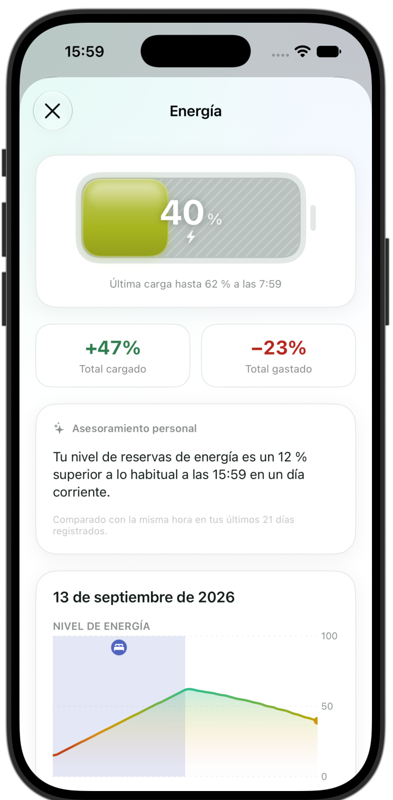 | 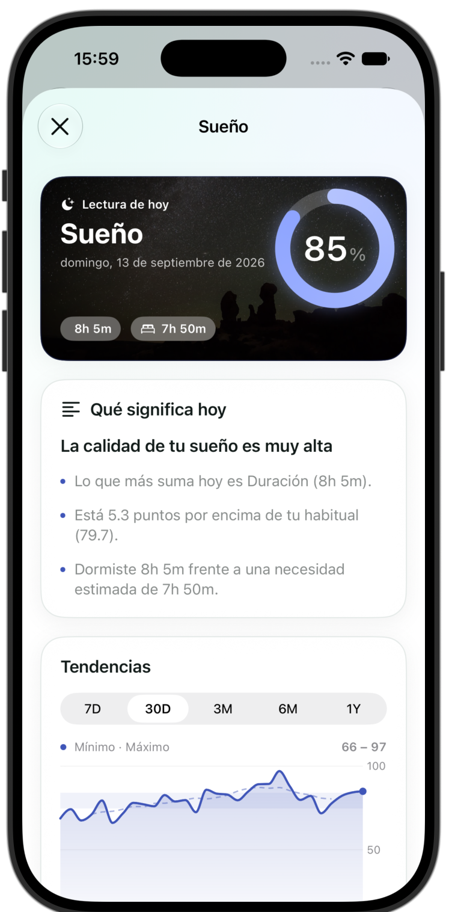 |

| Stress | Biology | Biological age |
|:---:|:---:|:---:|
| 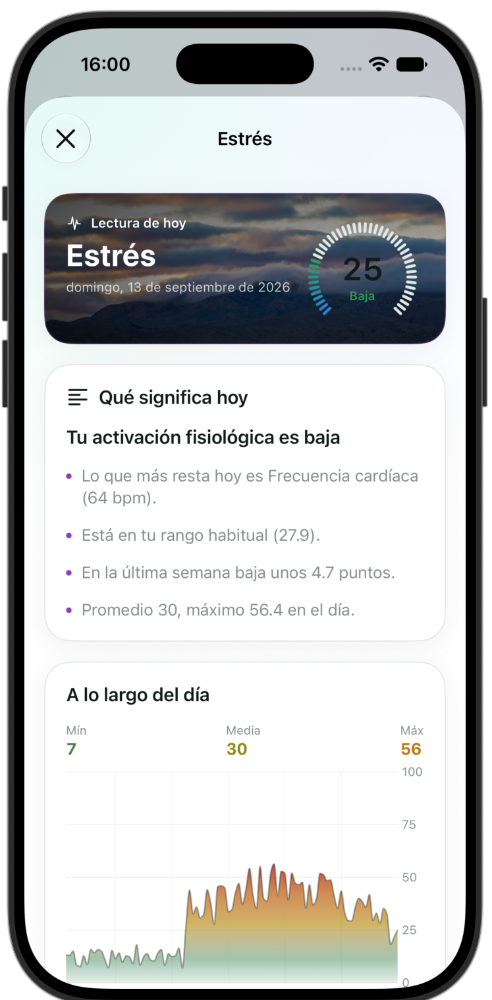 | 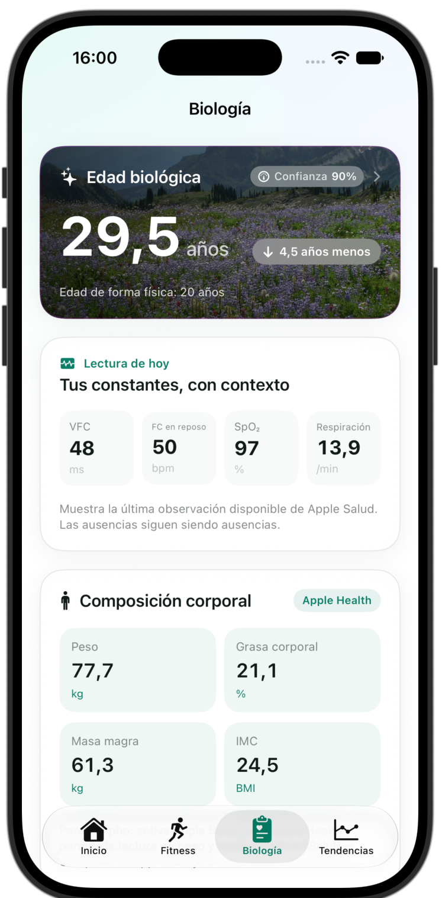 | 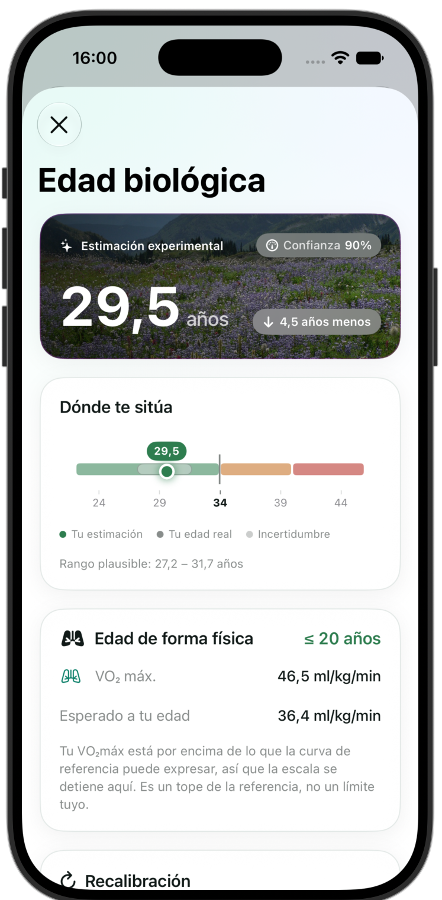 |

| Body | Journal | Training |
|:---:|:---:|:---:|
|  | 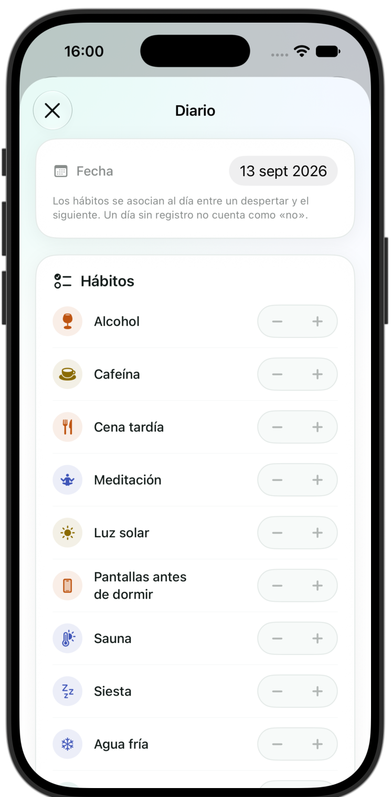 | 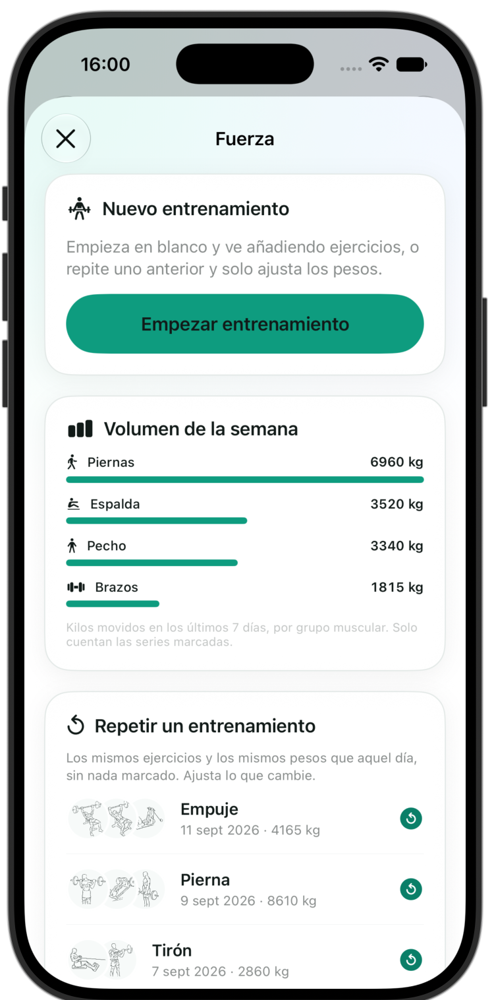 |

| Exercise library | Fitness | Trends |
|:---:|:---:|:---:|
| 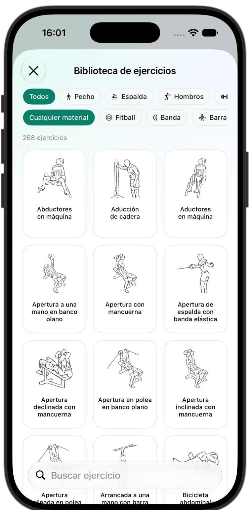 | 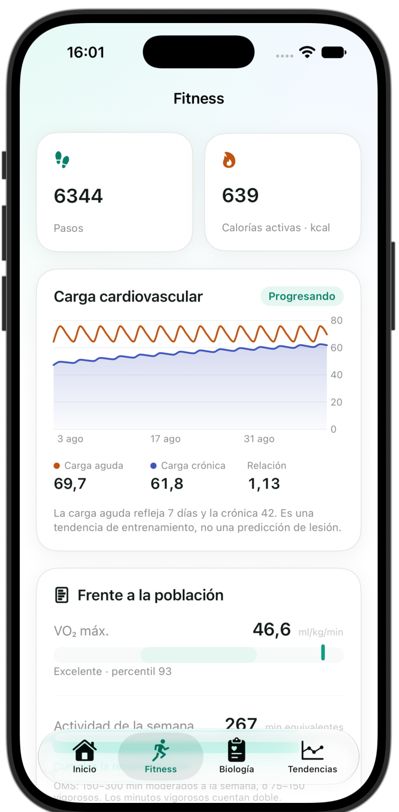 | 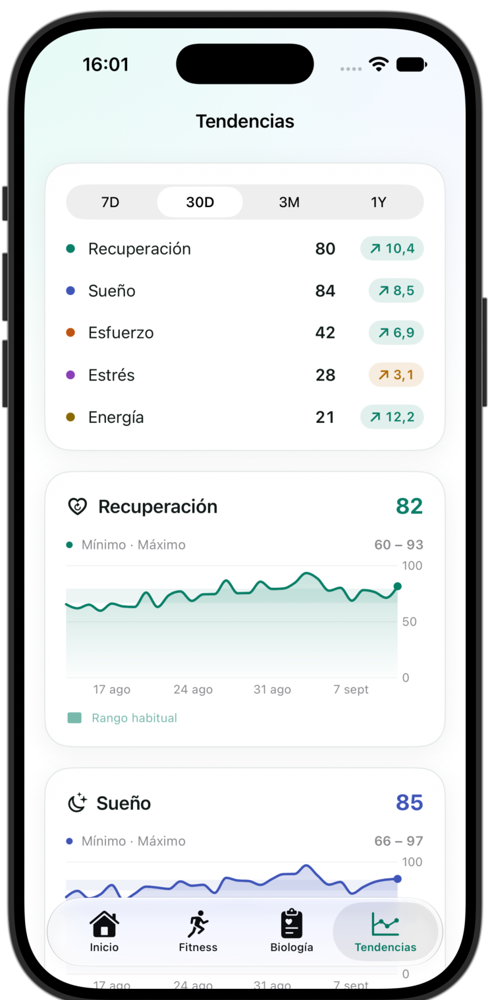 |

| Settings | Home · dark | Library · dark |
|:---:|:---:|:---:|
| 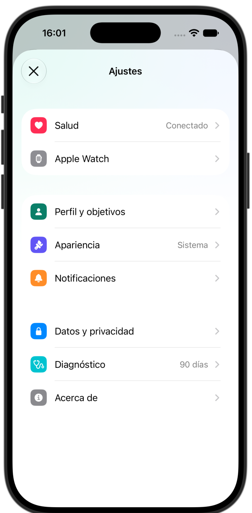 | 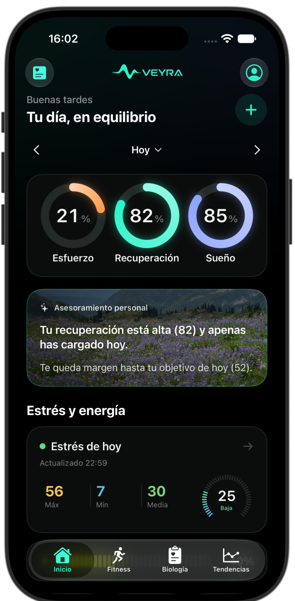 | 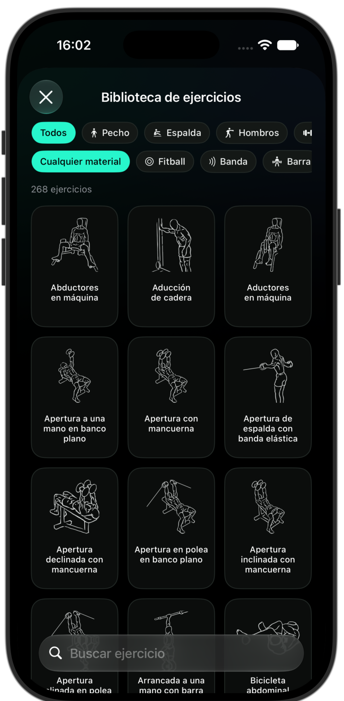 |

</div>

> Screenshots use deterministic synthetic data. They are not anyone's real
> health record. The interface is Spanish and English; the screenshots are
> Spanish.

---

## The metrics

| Metric | What it estimates | Main inputs |
|---|---|---|
| **Recovery** | Autonomic readiness | HRV, resting HR, sleep, respiration, temperature, SpO₂ |
| **Sleep** | Quality of the night | Duration against need, efficiency, continuity, stages, regularity, overnight HR dip |
| **Strain** | The day's load | Heart-rate zone load, strength load, non-workout activity |
| **Stress** | Physiological activation | HR and HRV against your own baseline, with movement as context |
| **Energy reserves** | Body battery, 0–100 | 15-minute simulation from the onset of the night |

Alongside them, the readings a watch records that carry a published reference
band of their own: wrist-temperature deviation, Apple's sleeping breathing
disturbances, chronotype from the mid-sleep point, atrial-fibrillation burden,
walking steadiness, blood pressure under both ACC/AHA and ESC/ESH — they
disagree, so both are shown — VO₂max percentile, and the week's activity against
the WHO guideline. Where Apple publishes the threshold itself, it is read from
HealthKit rather than hard-coded, so Veyra can never contradict the Health app
about the same sample.

Every score keeps its components, their weights and its confidence. The full
formulas are in [`Documentation/ALGORITHMS.md`](Documentation/ALGORITHMS.md),
and [`Documentation/EVIDENCE.md`](Documentation/EVIDENCE.md) audits every one of
them against the literature — separating what is **published**, what is
**derived** from published direction, and what is a **design decision** of ours
with no published equivalent. The body battery and the recovery weights fall in
that last category, and the document says so.

### Body battery

Simulated from **the onset of the night**, not from waking, so the overnight
recharge is visible. Each 15-minute interval records *why* the level moved —
sleep, rest, stress, exercise, waking — and that is what the breakdown shows. A
day with no recorded night carries the previous evening's level forward instead
of going blank.

### Biological age

Published biological-age methods (Klemera–Doubal, PhenoAge) **require blood
chemistry**, and a watch measures none of their markers. Veyra does not pretend
otherwise, and says so on the screen itself.

What a watch *can* anchor is fitness. VO₂max has normative curves by age and
sex, and inverting them gives something verifiable — *your VO₂max matches the
median for an N-year-old*. That is the anchor, weighted 35, and eight bounded
corrections sit on top: resting heart rate, training, HRV, sleep, sleep
regularity, steps, stress and body composition. The correction is scaled by the
confidence, so with little data the estimate stays close to your real age rather
than asserting a swing it cannot support.

### Training log

268 exercises, browsed by picture rather than by name, filtered by muscle group
and equipment. Each one animates between two frames to show the movement instead
of a pose.

Logging a session is a card per exercise and a row per set: weight, reps, a tick.
**New sets and repeated workouts arrive pre-filled from the last time you did
that exercise**, which is the difference between confirming numbers and typing
them. Tapping a field selects it, so typing replaces the suggestion. An exercise
you have never logged opens empty — no invented starting weight.

### Journal

Habits with their own icon and a switch: minus on one side, plus on the other,
the chosen side lit. "Not recorded" is a real third state and stays
distinguishable from "no", because a day you never filled in must not count as a
day without caffeine. `JournalInsightEngine` then compares each habit against the
recovery that followed it.

---

## Performance

A health app runs all day, so the cost of running it is part of the design.

- **Launch reads 90 days, not the whole history.** A year of snapshots is 10.5 MB
  of JSON — measured — and decoding it was the slowest thing the app did. The
  rest is read once there is something on screen. The exercise catalogue is
  decoded when a training screen first needs it.
- **Nothing is observed immediately except a finished workout.** Heart rate used
  to wake the app on every sample the watch wrote — dozens of times a day, each
  one starting a full import of forty types. It is hourly now, observations
  within ten minutes are coalesced, and an observation recalculates three days
  rather than the whole window.
- **Vital lookups are indexed**, not searched. Biology alone used to walk the
  entire history eighteen times per redraw.
- **The artwork cache is bounded**, so scrolling the library does not hold 537
  decoded bitmaps until the system is already under memory pressure.
- **The history is sorted once, not per redraw**, and returning to the app does
  not repeat a sync that just ran.

These are pinned by tests, not just by intent.

---

## Architecture

```
PulseCore/          Pure Swift package. No UI, no HealthKit. All the engines.
├── DailyEngine          Composes a full day from a batch of Health samples
├── SleepEngine          Stages, sessions, need and debt
├── RecoveryEngine       Scored against a personal baseline
├── PerformanceEngines   Strain, zones, cardio load, energy, strength
├── ConfidenceEngine     Confidence % = coverage × maturity × recency
├── WellnessAgeEngine    Fitness anchor and its corrections
├── BodyCompositionEngine BMI and body-fat reference scales
├── ScreeningEngines     Published reference bands for the watch's own readings
├── SleepRegularity      Sleep Regularity Index and heart-rate recovery
├── StrengthHistory      What you lifted last time, and this week's volume
└── MetricNarrator       Local, deterministic per-metric summaries

App/            Design system, scenes, charts, app model
Features/       Screens
Health/         HealthKit client
Persistence/    SwiftData
Watch/          watchOS app
Widgets/        WidgetKit (iOS and watchOS)
Tools/          Generators for committed data (the exercise catalogue)
```

`PulseCore` imports neither HealthKit nor SwiftUI, so the engines are tested
without a simulator or permissions.

### Decisions worth knowing

- **Data compatibility.** `LocalStore` deletes records it cannot decode, so a
  new required field would destroy the history. Every added field is optional
  and `UserPreferences` has an explicit `init(from:)`.
- **No dependencies.** Charts are Swift Charts; nothing third-party.
- **No network.** The app makes no requests at all.

---

## Privacy

- All processing is local. No account, no server, no analytics.
- Veyra **reads** from Health; it only writes the workouts you choose to record.
- Full JSON and CSV export, and complete deletion, from Settings.

---

## Limits

This is a personal project, and it is worth saying plainly:

- **Not a medical device.** No metric diagnoses anything. The body battery and
  the biological-age estimate are experimental.
- **Not Bevel.** Veyra takes inspiration from how Bevel organises information,
  but contains no one else's code, assets or formulas. The algorithms are its
  own and are documented.
- **Muscle mass, body water and bone mass do not arrive.** Apple Health
  publishes no official type for them, so they stay in your scale's own app
  however faithfully you sync. Lean mass does come through.
- **Apple does not expose the user's name** to apps, so Veyra cannot read it.
- **Health reports a denied read as an empty result**, never as an error, so an
  app cannot tell "no permission" from "no data". Settings → Diagnostics has a
  read probe that reports sample counts per type, which is the only way to see
  on the device which permission is actually off.

---

## Credits

The header photographs are verified public-domain landscapes; provenance is in
[`Documentation/CREDITS.md`](Documentation/CREDITS.md).

The exercise illustrations, names and instructions derive from the
[Everkinetic dataset](https://github.com/everkinetic/data) by Greg Priday, used
under **CC BY-SA 4.0**. The artwork was converted to alpha masks so the app can
tint it, and the Spanish translations are ours; both remain CC BY-SA and are
therefore **outside** this repository's all-rights-reserved terms. See
[`Resources/ExerciseArt/ATTRIBUTION.md`](Resources/ExerciseArt/ATTRIBUTION.md).

---

## Licence

**All rights reserved.** This repository is public so the work can be read and
reviewed. It is **not** open source and no licence is granted: you may not copy,
modify, redistribute or reuse this code, its algorithms or its assets in any
project of your own.

See [`LICENSE`](LICENSE) for the full terms.
