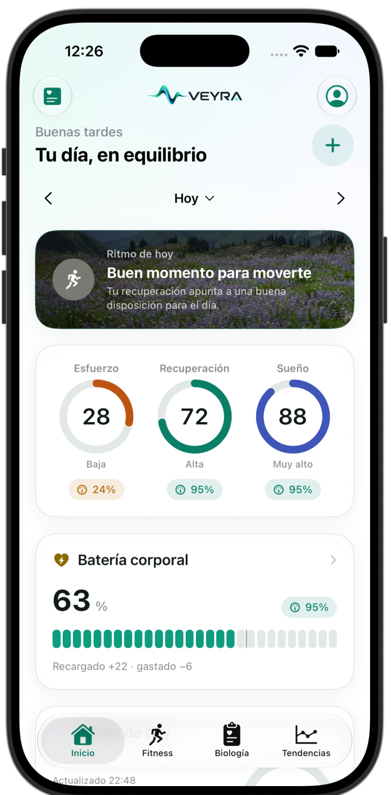
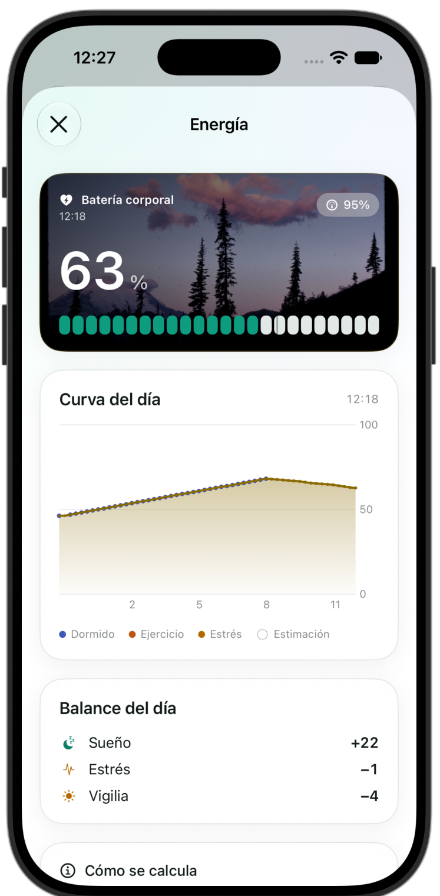
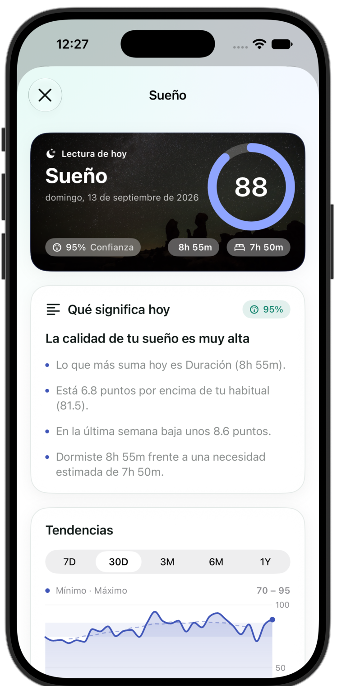
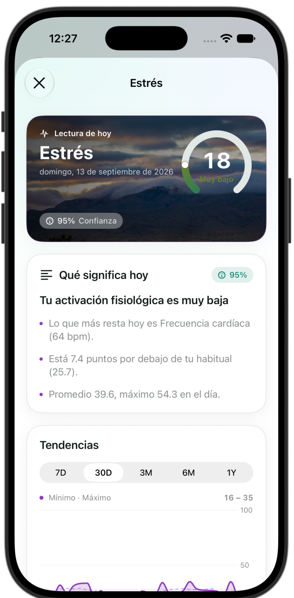
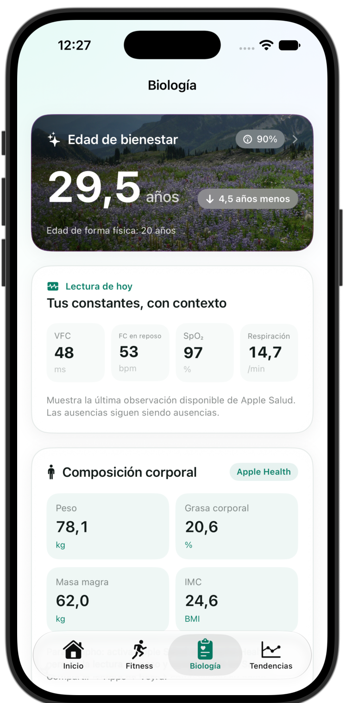
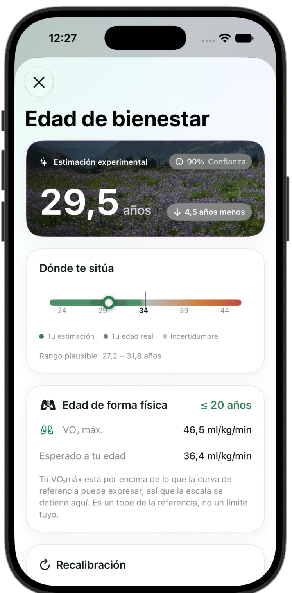
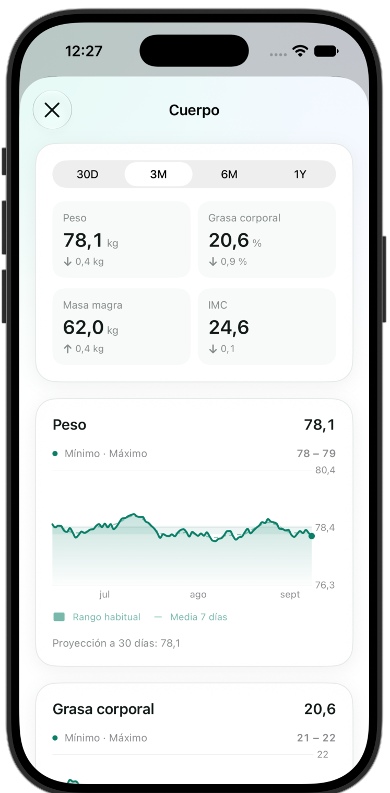
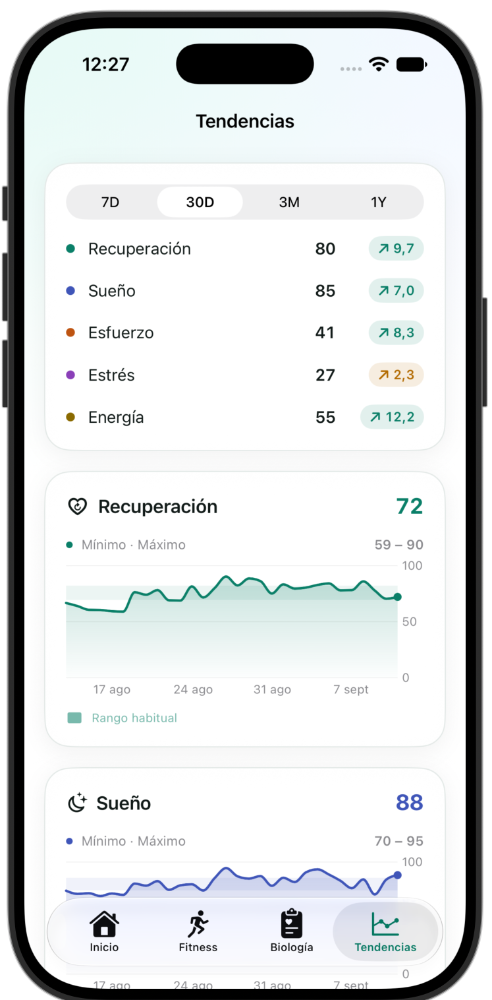
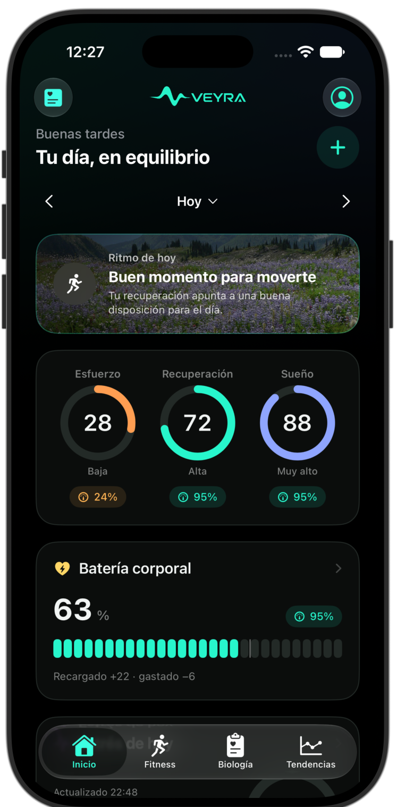
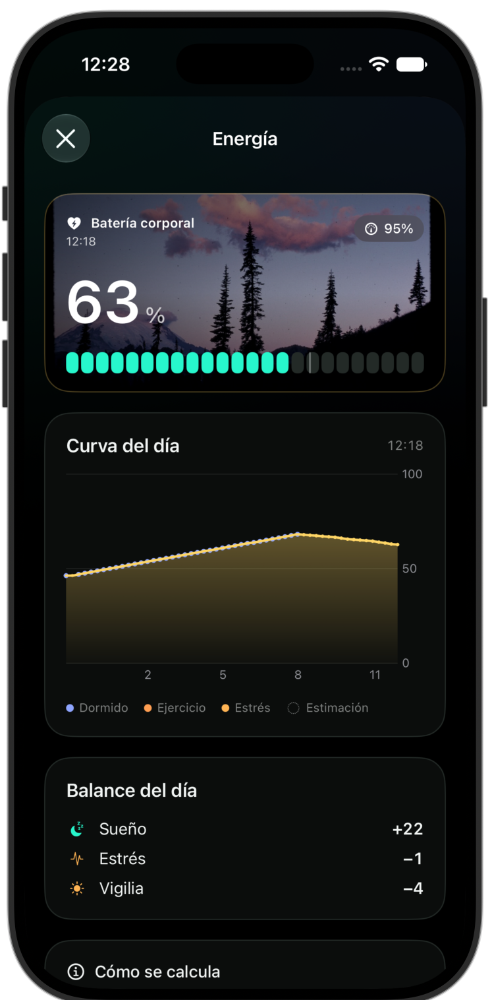

<div align="center">

<picture>
  <source media="(prefers-color-scheme: dark)" srcset="Documentation/Brand/veyra-logo-dark.png">
  
</picture>

**Panel de salud personal para iPhone y Apple Watch.**
Sueño, recuperación, esfuerzo, estrés y reservas de energía — calculado en el dispositivo, con la confianza siempre a la vista.

<br>


</div>

---

## Qué es

Veyra lee lo que tu Apple Watch ya escribe en Apple Salud y lo convierte en cinco
métricas diarias, sus tendencias y una edad de forma física. **Todo el cálculo
ocurre en el dispositivo**: no hay cuenta, ni servidor, ni telemetría.

El principio que gobierna el proyecto es sencillo: **un dato ausente se muestra
como ausente, nunca como cero**, y cada puntuación viene con el porcentaje de
confianza que merece y con las razones concretas por las que no es mayor.

<div align="center">

| Inicio | Batería corporal | Sueño |
|:---:|:---:|:---:|
|  |  |  |

| Estrés | Biología | Edad de bienestar |
|:---:|:---:|:---:|
|  |  |  |

| Cuerpo | Fitness | Tendencias |
|:---:|:---:|:---:|
|  |  |  |

| Ajustes | Inicio · oscuro | Batería · oscuro |
|:---:|:---:|:---:|
|  |  |  |

</div>

> Las capturas usan datos sintéticos deterministas (`--uitesting --seed`), no
> datos reales de nadie.

---

## Las métricas

| Métrica | Qué estima | Entradas principales |
|---|---|---|
| **Recuperación** | Disposición del sistema nervioso autónomo | VFC, FC en reposo, sueño, respiración, temperatura, SpO₂ |
| **Sueño** | Calidad de la noche | Duración frente a necesidad, eficiencia, continuidad, fases, regularidad, caída de FC nocturna |
| **Esfuerzo** | Carga del día | Carga por zonas cardíacas, carga de fuerza, actividad fuera de entrenamiento |
| **Estrés** | Activación fisiológica | FC y VFC frente a tu línea base, con el movimiento como contexto |
| **Reservas de energía** | Batería corporal 0–100 | Simulación en pasos de 15 min desde el inicio de la noche |

Cada puntuación conserva sus componentes, sus pesos y su confianza. Las fórmulas
completas, con sus referencias, están en
[`Documentation/ALGORITHMS.md`](Documentation/ALGORITHMS.md).

### Batería corporal

Se simula desde el **inicio de la noche**, no desde que te despiertas, así que la
recarga nocturna es visible. Cada intervalo de 15 minutos guarda por qué se
movió el nivel — sueño, descanso, estrés, ejercicio, vigilia — y eso es lo que
muestra el desglose. Un día sin noche registrada continúa desde el nivel de la
tarde anterior en vez de quedarse en blanco.

### Edad de forma física

La edad biológica publicada (Klemera–Doubal, PhenoAge) **necesita analítica de
sangre**, y un reloj no mide ninguno de sus marcadores. Veyra no finge lo
contrario.

Lo que sí se puede anclar con un reloj es la forma física: el VO₂máx tiene curvas
normativas por edad y sexo, y al invertirlas sale algo verificable — *tu VO₂máx
equivale a la mediana de alguien de N años*. Ese es el ancla, con peso 35, y
encima van ocho correcciones acotadas: FC en reposo, entrenamiento, VFC, sueño,
regularidad del sueño, pasos, estrés y composición corporal. La corrección se
escala por la confianza, así que con pocos datos la estimación se queda cerca de
tu edad real en vez de afirmar un salto que no puede sostener.

---

## Arquitectura

```
PulseCore/          Swift Package puro, sin UI ni HealthKit. Todos los motores.
├── DailyEngine          Compone el día completo a partir de un lote de Salud
├── SleepEngine          Fases, sesiones, necesidad y deuda
├── RecoveryEngine       Puntuación frente a línea base personal
├── PerformanceEngines   Esfuerzo, zonas, carga cardíaca, energía, fuerza
├── ConfidenceEngine     Confianza en % = cobertura × madurez × recencia
├── WellnessAgeEngine    Edad de forma física y sus correcciones
├── BodyCompositionEngine Escalas de referencia de IMC y grasa corporal
└── MetricNarrator       Resúmenes locales y deterministas por métrica

App/            Sistema de diseño, escenas, gráficas, modelo de la app
Features/       Pantallas
Health/         Cliente de HealthKit
Persistence/    SwiftData
Watch/          App de watchOS
Widgets/        WidgetKit (iOS y watchOS)
```

`PulseCore` no importa HealthKit ni SwiftUI, así que los motores se prueban sin
simulador ni permisos: `swift test --package-path PulseCore`.

### Decisiones que conviene conocer

- **Compatibilidad de datos.** `LocalStore` borra los registros que no
  decodifican, así que un campo nuevo obligatorio destruiría el historial. Todo
  campo añadido es opcional y `UserPreferences` tiene un `init(from:)` explícito.
- **Sin dependencias.** Gráficas con Swift Charts, nada de terceros.
- **Sin red.** La app no hace ninguna petición.

---

## Empezar

```bash
brew install xcodegen
xcodegen generate
open Veyra.xcodeproj
```

Para ejecutar en un dispositivo real necesitas tu equipo de desarrollo: copia
`Local.xcconfig.example` a `Local.xcconfig` y pon el tuyo. En simulador no hace
falta.

```bash
# Motores
swift test --package-path PulseCore

# App
xcodebuild test -project Veyra.xcodeproj -scheme Veyra \
  -destination 'platform=iOS Simulator,name=iPhone 17 Pro'
```

### Datos de revisión

HealthKit no existe en el simulador, así que la app arranca vacía. Para ver las
pantallas con contenido:

```bash
xcrun simctl launch "iPhone 17 Pro" local.pulselab --uitesting --seed
```

Genera 90 días deterministas **solo en memoria**: noches con estructura de fases
real, entrenamientos, tendencia de peso. Nunca alcanza una instalación real.

Argumentos disponibles: `--tab home|fitness|biology|trends` y
`--route energy|sleep|stress|recovery|strain|body|wellnessAge|settings|profile`.

---

## Privacidad

- Todo el procesamiento es local. No hay cuenta, servidor ni analítica.
- Veyra **lee** de Salud; solo escribe los entrenamientos que decidas registrar.
- Exportación completa en JSON y CSV, y borrado total desde Ajustes.

---

## Límites

Esto es un proyecto personal, y conviene decirlo sin adornos:

- **No es un producto médico.** Ninguna métrica diagnostica nada. La batería
  corporal y la edad de forma física son estimaciones experimentales.
- **No es Bevel.** Veyra se inspira en su organización de la información, pero no
  contiene código, recursos ni fórmulas de nadie más. Los algoritmos son propios
  y están documentados.
- **Masa muscular, agua corporal y masa ósea no llegan.** Apple Salud no publica
  un tipo oficial para ellas, así que se quedan en la app de tu báscula por mucho
  que las sincronices. La masa magra sí llega.
- **Apple no expone el nombre del usuario** a las apps: Veyra no puede leerlo.

---

## Créditos

Las fotografías de cabecera son paisajes en dominio público verificado, con su
procedencia en [`Documentation/CREDITS.md`](Documentation/CREDITS.md).

## Licencia

MIT. Ver [`LICENSE`](LICENSE).
