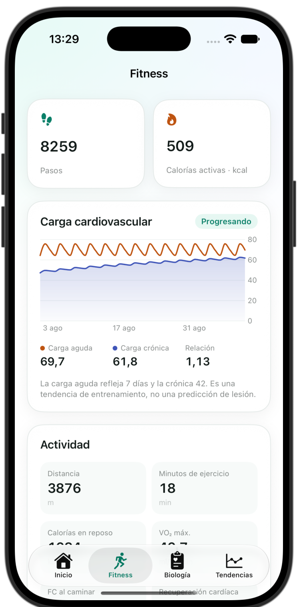
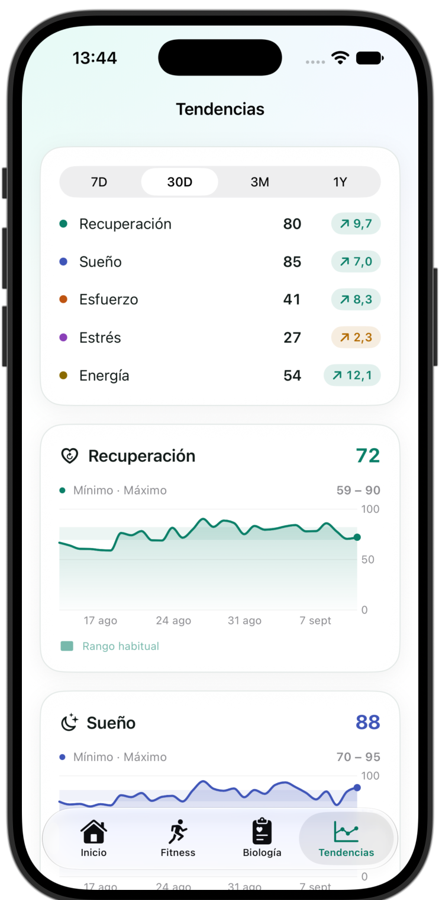
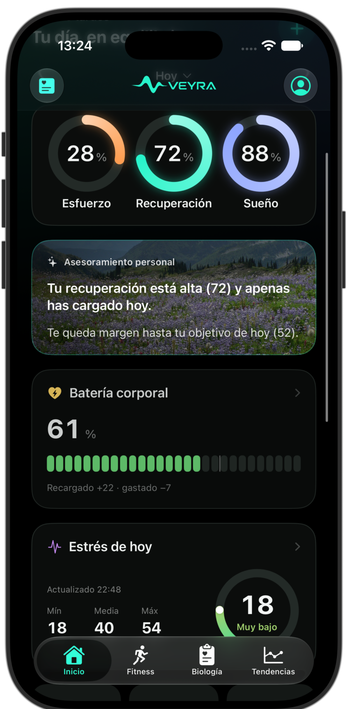

<div align="center">

<picture>
  <source media="(prefers-color-scheme: dark)" srcset="Documentation/Brand/veyra-logo-dark.png">
  
</picture>

**Personal health dashboard for iPhone and Apple Watch.**
Sleep, recovery, strain, stress and energy reserves — computed entirely on device, with the confidence in plain sight.

<br>


</div>

---

## What it is

Veyra reads what your Apple Watch already writes to Apple Health and turns it
into five daily metrics, their trends, and a biological-age estimate.
**Everything is computed on device**: no account, no server, no telemetry.

One principle governs the whole project: **missing data is shown as missing,
never as zero**, and every score carries the confidence it deserves along with
the specific reasons it is not higher.

<div align="center">

| Home | Body battery | Sleep |
|:---:|:---:|:---:|
|  |  |  |

| Stress | Biology | Biological age |
|:---:|:---:|:---:|
|  |  |  |

| Body | Fitness | Trends |
|:---:|:---:|:---:|
|  |  |  |

| Settings | Home · dark | Battery · dark |
|:---:|:---:|:---:|
|  |  |  |

</div>

> Screenshots use deterministic synthetic data. They are not anyone's real
> health record. The interface is Spanish and English; the screenshots are
> Spanish.

---

## The metrics

| Metric | What it estimates | Main inputs |
|---|---|---|
| **Recovery** | Autonomic readiness | HRV, resting HR, sleep, respiration, temperature, SpO₂ |
| **Sleep** | Quality of the night | Duration against need, efficiency, continuity, stages, regularity, overnight HR dip |
| **Strain** | The day's load | Heart-rate zone load, strength load, non-workout activity |
| **Stress** | Physiological activation | HR and HRV against your own baseline, with movement as context |
| **Energy reserves** | Body battery, 0–100 | 15-minute simulation from the onset of the night |

Every score keeps its components, their weights and its confidence. The full
formulas are in [`Documentation/ALGORITHMS.md`](Documentation/ALGORITHMS.md),
and [`Documentation/EVIDENCE.md`](Documentation/EVIDENCE.md) audits every one of
them against the literature — separating what is **published**, what is
**derived** from published direction, and what is a **design decision** of ours
with no published equivalent. The body battery and the recovery weights fall in
that last category, and the document says so.

### Body battery

Simulated from **the onset of the night**, not from waking, so the overnight
recharge is visible. Each 15-minute interval records *why* the level moved —
sleep, rest, stress, exercise, waking — and that is what the breakdown shows. A
day with no recorded night carries the previous evening's level forward instead
of going blank.

### Biological age

Published biological-age methods (Klemera–Doubal, PhenoAge) **require blood
chemistry**, and a watch measures none of their markers. Veyra does not pretend
otherwise, and says so on the screen itself.

What a watch *can* anchor is fitness. VO₂max has normative curves by age and
sex, and inverting them gives something verifiable — *your VO₂max matches the
median for an N-year-old*. That is the anchor, weighted 35, and eight bounded
corrections sit on top: resting heart rate, training, HRV, sleep, sleep
regularity, steps, stress and body composition. The correction is scaled by the
confidence, so with little data the estimate stays close to your real age rather
than asserting a swing it cannot support.

---

## Architecture

```
PulseCore/          Pure Swift package. No UI, no HealthKit. All the engines.
├── DailyEngine          Composes a full day from a batch of Health samples
├── SleepEngine          Stages, sessions, need and debt
├── RecoveryEngine       Scored against a personal baseline
├── PerformanceEngines   Strain, zones, cardio load, energy, strength
├── ConfidenceEngine     Confidence % = coverage × maturity × recency
├── WellnessAgeEngine    Fitness anchor and its corrections
├── BodyCompositionEngine BMI and body-fat reference scales
└── MetricNarrator       Local, deterministic per-metric summaries

App/            Design system, scenes, charts, app model
Features/       Screens
Health/         HealthKit client
Persistence/    SwiftData
Watch/          watchOS app
Widgets/        WidgetKit (iOS and watchOS)
```

`PulseCore` imports neither HealthKit nor SwiftUI, so the engines are tested
without a simulator or permissions.

### Decisions worth knowing

- **Data compatibility.** `LocalStore` deletes records it cannot decode, so a
  new required field would destroy the history. Every added field is optional
  and `UserPreferences` has an explicit `init(from:)`.
- **No dependencies.** Charts are Swift Charts; nothing third-party.
- **No network.** The app makes no requests at all.

---

## Privacy

- All processing is local. No account, no server, no analytics.
- Veyra **reads** from Health; it only writes the workouts you choose to record.
- Full JSON and CSV export, and complete deletion, from Settings.

---

## Limits

This is a personal project, and it is worth saying plainly:

- **Not a medical device.** No metric diagnoses anything. The body battery and
  the biological-age estimate are experimental.
- **Not Bevel.** Veyra takes inspiration from how Bevel organises information,
  but contains no one else's code, assets or formulas. The algorithms are its
  own and are documented.
- **Muscle mass, body water and bone mass do not arrive.** Apple Health
  publishes no official type for them, so they stay in your scale's own app
  however faithfully you sync. Lean mass does come through.
- **Apple does not expose the user's name** to apps, so Veyra cannot read it.

---

## Credits

The header photographs are verified public-domain landscapes; provenance is in
[`Documentation/CREDITS.md`](Documentation/CREDITS.md).

---

## Licence

**All rights reserved.** This repository is public so the work can be read and
reviewed. It is **not** open source and no licence is granted: you may not copy,
modify, redistribute or reuse this code, its algorithms or its assets in any
project of your own.

See [`LICENSE`](LICENSE) for the full terms.
